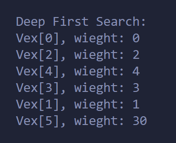

# Lab 8 Report

## 基于图实现的算法

PB22111599 杨映川

### 静态结构体

### Dijstra算法求最短路径

#### 代码

> 注意INFINITY == 999

#### 说明

420-427行：**初始化**所有距离为INFINITY，再将起始点到自己的距离改为0。

429：设置一个循环，**每次会遍历1个新的顶点**直至遍历完图的所有顶点。

431-441：**找到**此时已遍历了的点集所连接的**最短边**，并将这条边连接到的未遍历的点集中的点赋值给min_v, 标记其已被遍历。

442-449：**遍历min_v**这一点的各条**邻边所连的点**，若此时找到了起始点到这些点的更短的距离则更新Dist[]的值。

450-452：以表格方式**输出**

实现：
对于以下图，执行函数`Dijstra(g, 0);`

输出结果：

### 求联通片个数

#### 代码

#### 实现

在主函数中使用以下代码进行测试：

> 581行代码添加的点的编号为5

输出结果如下：

### 深度优先搜索

#### 代码

#### 实现

对以下图使用深度优先搜索

输出：

> 0 -> 2 -> 4 -> (回到2) -> 3 -> 1 -> (回到0) -> (此联通片遍历完成) -> (下一个联通片) -> 5

### 广度优先搜索

#### 代码

#### 实现

对以下图使用广度优先搜索

输出：

> 0 -> 2, 4, 1 -> 3 -> (此联通片遍历完成) -> (下一个联通片) -> 5

### 问题

无。
