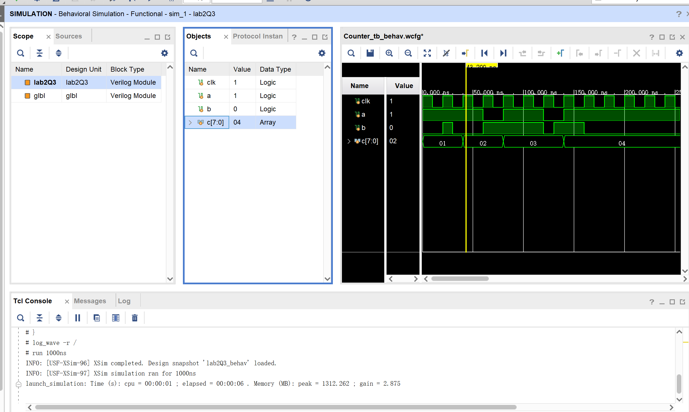
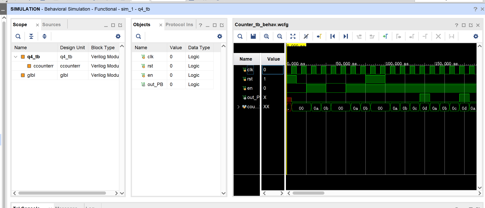

# Lab 2 report

**PB22111599 杨映川**

#T1
>       module top_module (
>           input                       cpu_overheated,
>           output  reg                 shut_off_computer,
>           input                       arrived,
>           input                       gas_tank_empty,
>           output  reg                 keep_driving
>       );
>           // Edit the code below
>           always @(*) begin
>               if (cpu_overheated)
>                   shut_off_computer = 1'b1;
>               else
>                   shut_off_computer = 1'b0;
>           end
>       
>           always @(*) begin
>               if (~arrived)
>                   keep_driving = ~gas_tank_empty;
>               else
>                   keep_driving = 1'b0;
>           end
>       endmodule
***
#T2
>     module top_module (
>         input       [15:0]                  scancode,
>         output reg                          left,
>         output reg                          down,
>         output reg                          right,
>         output reg                          up
>     ); 
>         always @(*) begin
>             up = 1'b0; down = 1'b0; left = 1'b0; right = 1'b0;
>             case (scancode)
>                 16'he06b: left = 1'b1;
>                 16'he072: down = 1'b1;
>                 16'he074: right = 1'b1;
>                 16'he075: up = 1'b1;
>                 defalut:;
>             endcase
>         end
>     
>     endmodule
***
#T3

实现代码：
>      module lab2Q3();
>          reg         clk;
>          reg         a;
>          reg         b;
>          reg [7:0]   c;
>      
>          initial begin
>              clk = 1;
>              a = 1;
>              b = 0;    
>              c = 8'b0;
>              c = c + 1;
>              #20;
>              b = ~b;
>              #10;
>              b = ~b;
>              #10;
>              c = c + 1;
>              #20;
>              a = ~a;
>              b = ~b;
>              #20;
>              a = ~a;
>              c = c + 1;
>              #40;
>              a = ~a;
>              b = ~b;
>              #10;
>              b = ~b;
>              #10;
>              a =~a;
>              c = c + 1;
>              #20;
>              b = ~b;
>          end
>          always #10 clk = ~clk;
>      
>      endmodule

生成波形图：

***
#T4
修改后的代码：
>     module ccounterr #(
>         parameter   MAX_VALUE = 8'd13,
>         parameter   MIN_VALUE = 8'd10
>     )(
>         input                   clk,
>         input                   rst,
>         input                   enable,
>         output                  out
>     );
>     
>     reg [7:0] counter;
>     always @(posedge clk) begin
>         if (rst)
>             counter <= 0;
>         else 
>             begin
>             if (enable) begin
>                 if (counter == 0)
>                     counter <= MIN_VALUE;
>                 else if (counter >= MAX_VALUE)
>                     counter <= MIN_VALUE;
>                 else
>                     counter <= counter + 8'b1; 
>             end
>             else
>                 counter <= 0;
>         end
>     end
>     
>     assign out = (counter == MAX_VALUE);
>     endmodule
使用以下测试代码：
>     module q4_tb();
>     reg clk, rst, en;
>     wire out_PB;
>     initial begin
>         clk = 0; rst = 1; en = 0;
>         #10;
>         rst = 0;
>         #10;
>         en = 1;
>         #20;
>         en = 0;
>         #20;
>         en = 1;
>         #20;
>         rst = 1;
>         #20;
>         rst = 0;
>         #200;
>         en = 0;
>     end
>     always #5 clk = ~clk;
>     ccounterr #(
>         .MIN_VALUE(8'd10), 
>         .MAX_VALUE(8'd13)
>     ) ccounterr (
>         .clk(clk),
>         .rst(rst),
>         .enable(en),
>         .out(out_PB)
>     );
>     endmodule
在Vivado中获得波形图：

>可见
>
>当`rst == 1`时，
>`counter`的值保持在`00`；
>
>当`rst == 0`，`en == 1`时，
>`counter`的值在从`0a`到`0d`的范围内变化
>当`counter`的值到达最大值后
>`out_PB == 1`并将`counter`的值重置到`0a`
>即实现`counter`在`MAX_VALUE`和`MIN_VALUE`的范围之间变化
>
>当`rst == 0`, `en == 0`时
>`counter`的值为`00`
***
#T*2
>       RTL_GEQ      ->   代码第12-14行，判断counter是否大于MAX_VALUE
>       RTL_MUX      ->   代码第10-11行，判断rst是否为1
>       RTL_REG_SYNC ->   代码第9-18行，代表always循环
>       RTL_ADD      ->   代码第15-16行，对counter进行加一操作
>       RTL_EQ       ->   代码第19行，计算out的值
