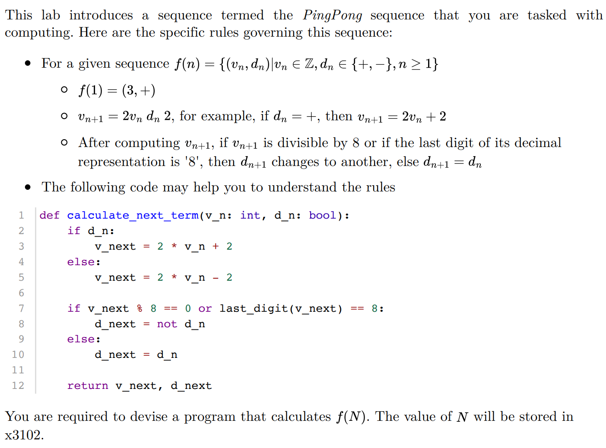
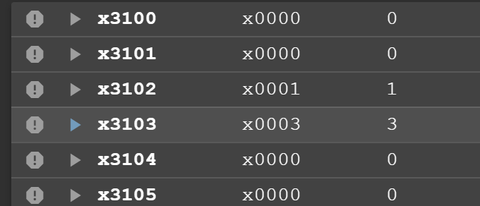
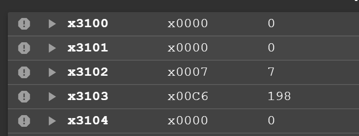
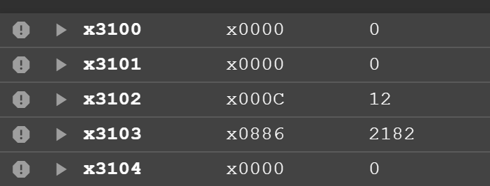
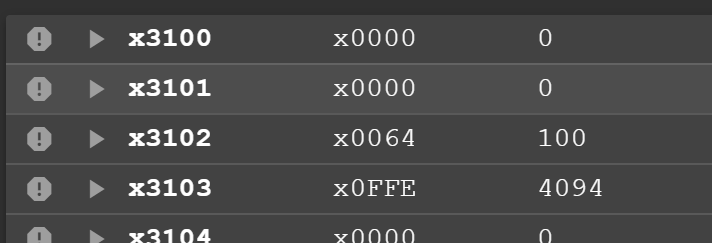

# Lab 2 report

-**PB22111599 杨映川**

## Purpose

In short, the task is to calculate a certain number sequence that changes the formation of increasing depending on the latest result.

## Principles

1) In order to do ***`Res = Res * 2`***, the instruction `ADD R0, R0, R0` is used while the result is loaded in R0.
2) In order to ***judge whether the last digit of the result is 8 or not***, the result first adds to 10 then subtracts 8.

>>>Adding to 10 is to maintain the result with only one digit to be valid( in other words, to be positive) before the followinng judging step.

 Next, keep subtracting 10 from the result until it turns 0 or negative. When the result is at last 0, it means the result has its last digit to be 8 at the very start, which indicates that the sign of the constant in the function need to switch.

3) In order to ***judge whether the result is the multiple of 8***, AND the result with `0_0111`(binary). If the result turns to 0, it means the number is the multiple of 8 and the sign need to switch.
4) No term of f(N) will surpass 4096 so the result are supposed to be the ***modulus of 4096***. The register R6 is used to store `x0FFF`, which will be ANDed every time after the result is figured out. By doing this, the result will turn into the modulus of 4096.

## Procedures

**The basic steps of this program are as follows:** 
>
> 1) **Initialization** of the registers.
> 2) **Calculate** the next result, N subtracts 1.
> 3) **Judge** if the sign needs to be switched according the present result.
> 4) **Loop** back to step 2 if the N is not 0 yet.

**Encountered Challenges** 
There exists a kind of ***situation that the number has its last digit to be 8 meanwhile it is the multiple of 8***, for example 8. To avoid the sign of the constant in the function from being switched two times in one procedure, a new register R5 is used to store the temporarily updated value of R1 that stores the information of the sign. After the two judgements are done, load the value of R5 into R1.

## Results

**example 1**
> N = 1
> f(N) = 3

**example 2**
> N = 7
> f(N) = 198

**example 3**
> N = 12
> f(N) = 2182

**example 4**
> N = 100
> f(N) = 4094

## Improvements
>
> Q: How might you optimize the efficiency of loop structures in your program?

 

> A: Use an ***improved algorithm*** with lower time complexity. 
> For example, using a new register to store the last digit of the present result, so as to process the digit individually. This method increases the space complexity for using more memeory while decreases the time complexity. 
> Another method is to subtract 1000 from the result untill it is less than 1000, which attains the modulus of 1000. Then perform the procedure with 100 and then 10 to finally get the modulus of 10. Since subtracting 1000 takes the place of subtracting 10 for 100 times, the time complexity can be remarkably decreased.
