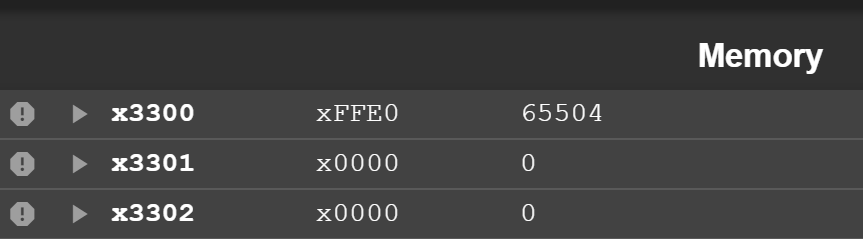
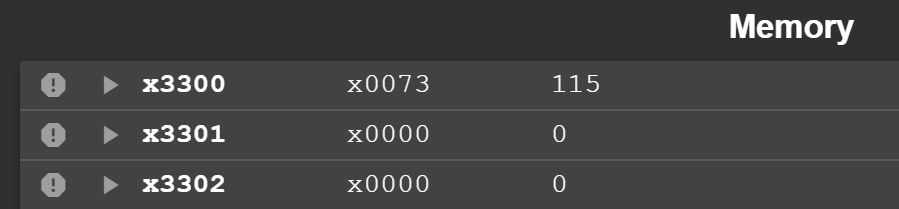
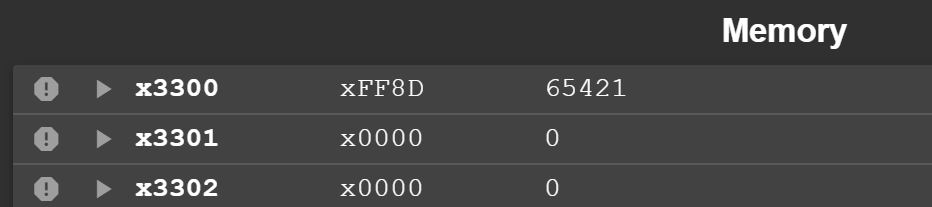

# Lab 3 Report

--**PB22111599 杨映川**

## Purpose

Imitating the strcmp() function in C language, create a program that, takes two strings(arrays of characters) as arguments, compares these two strings **lexicographically**.

The program compares the ASCII value of each character till the non-matching value is found or the NULL character is found.

At last, the program returns the difference of the values of the non-matching charaters, or 0 which represents that the two strings are identical.

## Principles

1) In order to **get the characters** stored from x3100 and x3200, the instructions LD and LDR are used. At the end of each loop procedure, add 1 to the addresses of the strings to prepare for the operations to the next characters.
2) In order to **attain the difference** of the two ASCII values, get the 2's complement of the second character then add it to the first one.

## Procedure

1) It might have been a little bit confusing without a **flowchart** which clearly shows the order to execute every procedur. Therefore, I made a flowchart at the beginning.
2) **Calculate the difference before judging** if the program should halt to prevent the situation in which, when the two strings have different lengths, the output would become 0 instead of the difference of the ASCII values. For instance, "daTA" and "daTAs", if the calculation step executes after the judgement step, the difference has not yet been calculated the program has come to its end.

## Results

### example 1

#### input

>       1st string: DsTAs
>       2nd string: DstA

#### output

### example 2

#### input

>       1st string: DsTAs
>       2nd string: DsTA

#### output

### example 3

#### input

>       1st string: DsTA
>       2nd string: DsTAs

#### output

