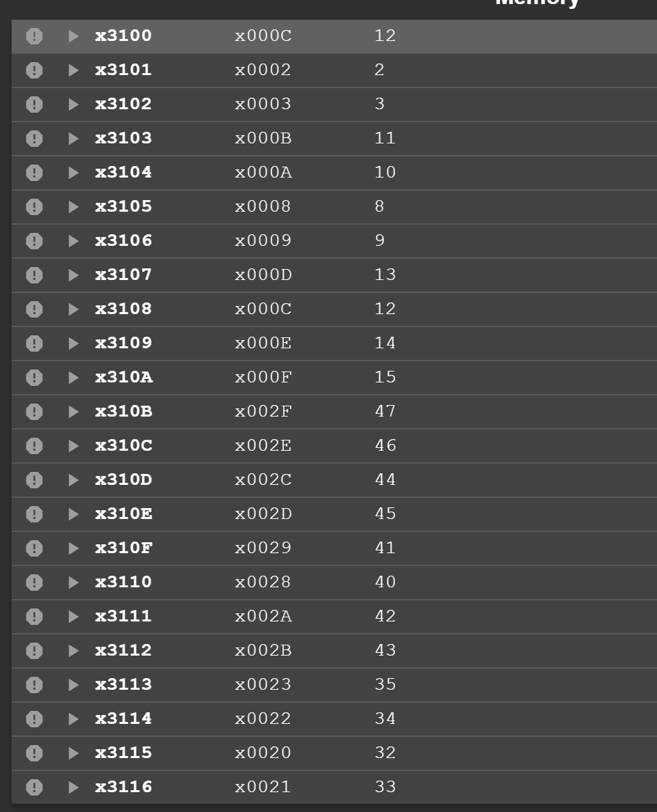

# Lab 4 Report

--**PB22111599 杨映川**

## Purpose

Visualize the process of solving the **Baguenaudier puzzle** with recursion algorithm of the lc3 assembly language.

## Principles

1) In order to pretend from losing the corresponding return addresses amongst the recursion operations, a **stack** starting from x4000 is used to load the addresses. R5 is the stack pointer.
2) In order to update the state of the baguenaudier, first locate the bit at the correct digit. If the operation is to remove the ring, then ADD the bit code to the current state code; if the operation is to put the ring, then NOT the bit code then AND it to the current state code.
3) In order to maintain the value of the number of the the rings, at the both sides of the recursion instruction, which is the JSR instruction, subtract 1 or 2, which depends on the recursion function given inside the lab file, then add it back.
4) According to the lab file, P(i) is the inverse of R(i). We can figure out that:

> R(0) = nothing to do;
> R(1) = remove the 1st ring;
> R(i) = R(i - 2) + remove the i-th ring + P(i - 2) + R(i - 2), i >= 2;
> ************
> P(0) = nothing to do;
> P(1) = put the 1st ring;
> **P(i) = P(i - 1) + R(i - 2) + put the i-th ring + P(i - 2)**, i >= 2;

## Procedure

1) Figure out the principle of how the recursion works in lc3 assembly language. Every time a JSR or a JSRR instruction is executed, the return address, i.e the PC incremented, is loaded into R7. The RET instruction at the end of the a sub-function will steer the program back to the correct address.
2) Encode a C language version to help figure out how the program goes.

## Result

### example 1

* n = 3

#### output

### example 2

* n = 12

#### output

* over 2000 items **omitted**

