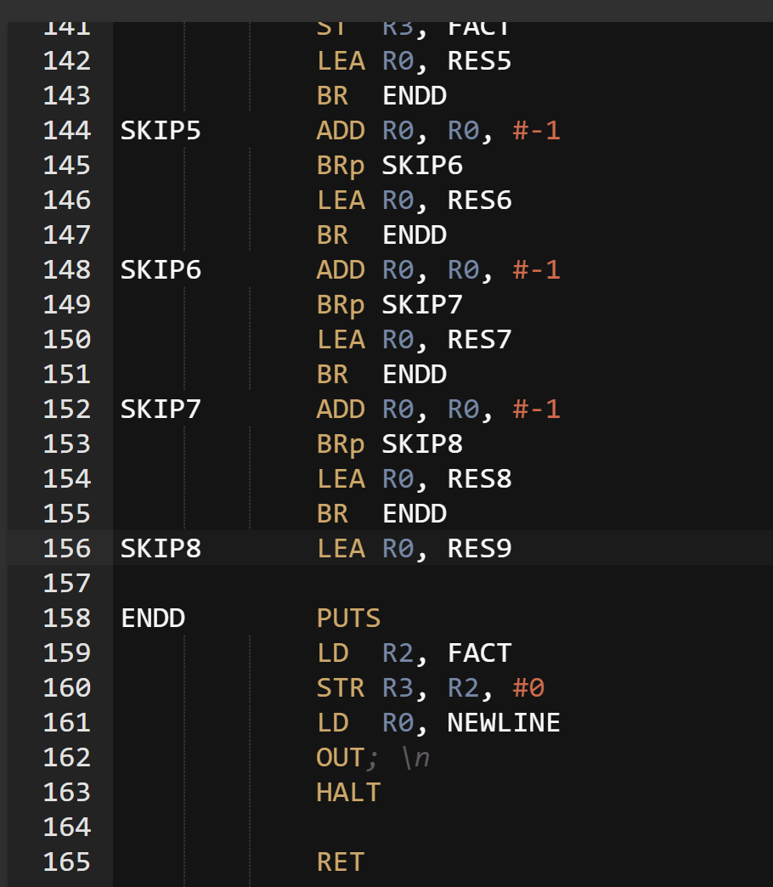
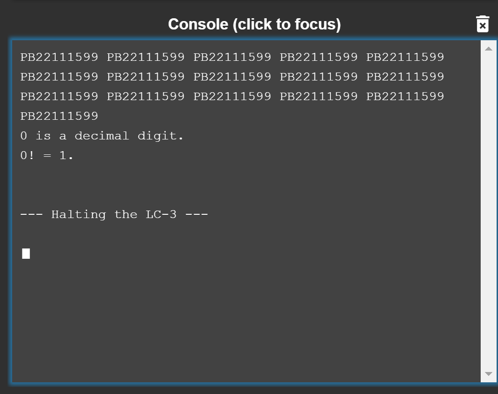
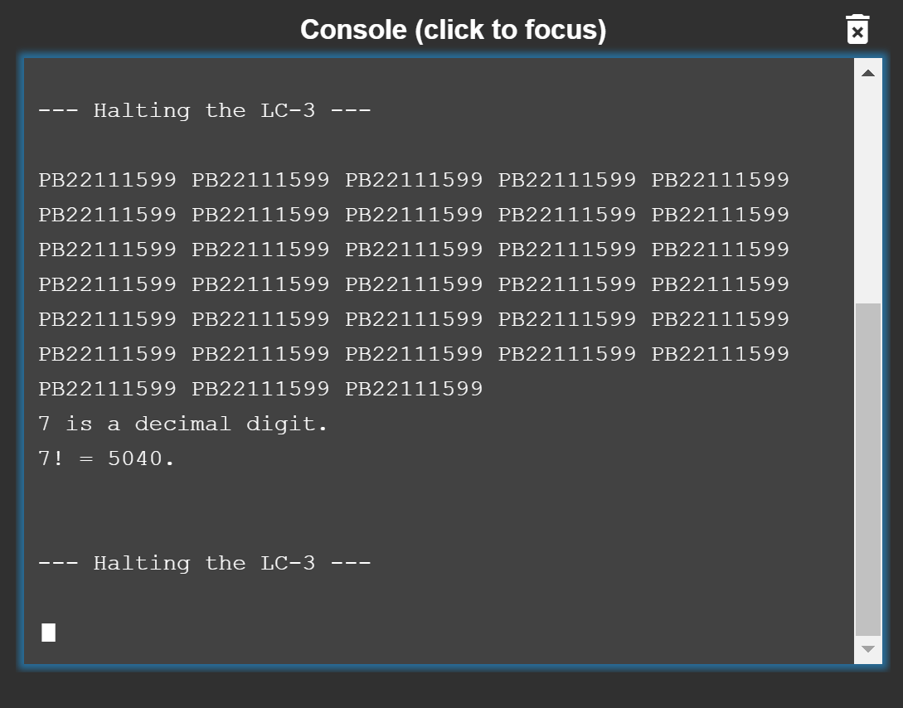
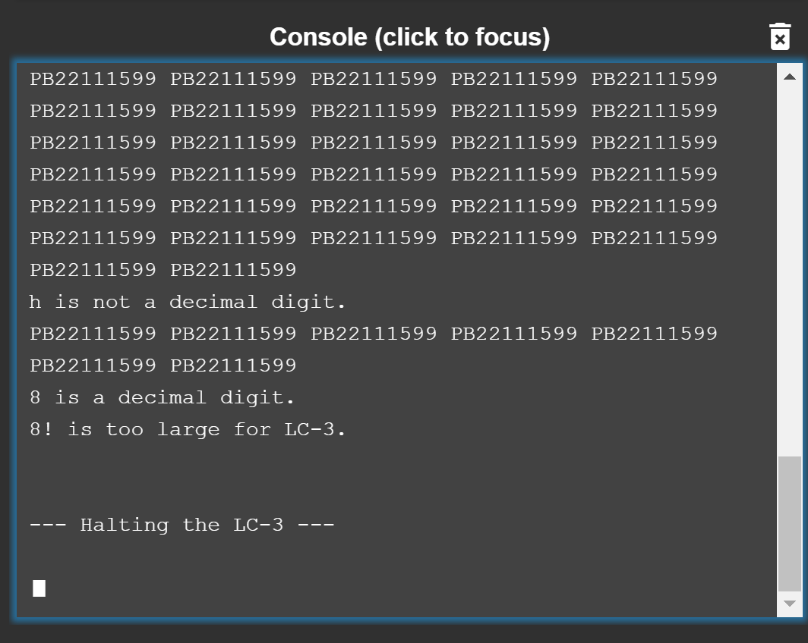

# Lab 6 Report

--**PB22111599**

## Purpose

Show how interrupt-driven I/O can interrupt a program that is running, execute the interrupt service routine, and return to the interrupted program, picking up exactly where it left off(just as nothing had happened).

## Principles

1) The main program which starts from x3000 will **keep on printing** my student ID which is **PB22111599** onto the console. The ISR expect an input from the keyboard.
2) When **a key is struck** the KBSR will change its value and then teh program jumps into the ISR part which starts from x1000.
3) The ISR part will **judge if the input character is a decimal number**. If yes, the program will output the factorial of the decimal number and the decimal number will be stored in x3FFF; then the program halts. If no, the ISR part ends and the main program resumes to print.

## Procedure

1) Considering that this program only takes 10 numbers into account as "valid", so it is more convenient to implement the factorial calculation by **brute force method**.

## Results

### example 1

input 0

### example 2

input 7

### example 3

input h then 8

