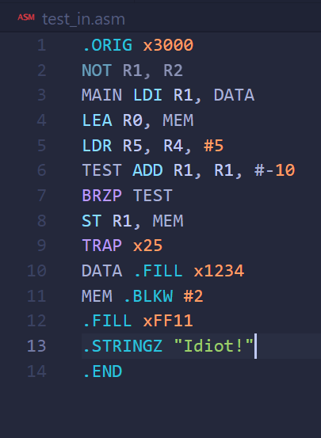

# Lab 7 Report

--**PB22111599 杨映川**

## Purpose

Implement a basic assembler for the LC-3 assembly language.

## Principles

1) Using the 2-pass method, the whole program will be traversed two times.
2) The 1st traverse is to locate all the labels and then store them into a specific table, which I used a `struct` array to achieve.
3) The 2nd traverse is to translate the assembly code line by line into the machine code.
4) For instructions like BR, LD, LDI, LDR, JSR that can be written either with numbers or labels, I used the function `NumOrLabel` in which includes both the `immediatenumberprocess` function and the `labelprocess` function that will execute according to the input.
5) For instructions like ADD, NOT, STR that can be followed by registers, I uesd the function `registerprocess` which will transform the number of the register into a 3-bit binary string snippet.

## Procedure

1) Pseudo operations like .STRINGZ and .BLKW will generate a few lines of machine code, so inside one line of output[i] several '\n' are used to create new lines.
2) In order to improve the readability of the code, types of repetitive procedure are bagged together into one function. For example, the `NumOrLabel` function includes the `immediatenumberprocess` function and the `labelprocess` function. And inside each of the function there is a smaller function `BinCode` or `Value2Bin`.
3) The `BinCode` function will transform a string of numbers in either decimal or hexadecimal into its corresponding binary code string.
4) The `Value2Bin` function will transform a specific value, of course in decimal, into its corresponding binary code string.
5) The process above greatly decreases the difficulty to finish the whole program.
6) It is a big problem to cut off a piece of label inside one entire instruction, so the operations below are used to ensure the piece that is read in is correct.

## Results

### example 1

Using the file "test_in.asm" whose contents are:

>       .ORIG x3000
>       MAIN LD R1, DATA
>       TEST ADD R1, R1, #-10
>       BRZP TEST
>       ST R1, MEM
>       TRAP x25
>       DATA .FILL x1234
>       MEM .BLKW #1
>       .END

The output that is copied into the file "test_out.txt" is:

>       0011000000000000
>       0010001000000100
>       0001001001110110
>       0000011111111110
>       0011001000000010
>       1111000000100101
>       0001001000110100
>       0000000000000000

### example 2

Using the file with the contents below:

The output that is copied into another file is:

