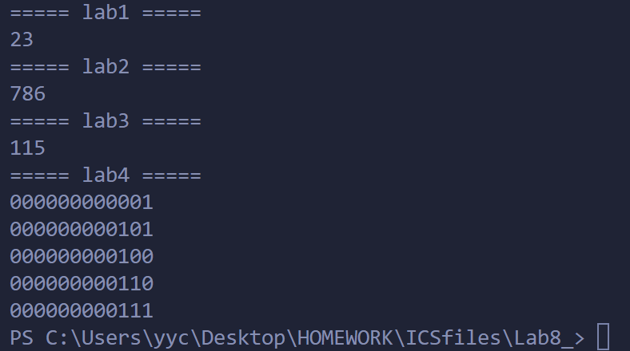

# Lab 8 Report

--**PB22111599杨映川**

## Purpose

Implement the previous 4 labs with a high level language which is C.

## Principles

### Lab 1 Counting zeros

With necessary operation signs, the whole process was mimicked:

1) AND the data with 1 then NOT it to get if the data is even or not. Get the 2's complement of the data if it is even.
2) Bitewisely AND the data with the test bit to count the number of 0's.
3) Add the last digit of my student ID which is 9 to form the final result.

### Lab 2 PingPong Sequence

Inside one procedure of the loop,

1) Update the value of the f(x) with the current information.
2) Judge if the result is the multiple of 8 by continually subtracting 8 from the result to get the remainder. Increment the flip if the remainder is 0.
3) Judge if the last digit of the result is 8 by subtracting an 8 then the higher digits from the result to get the difference of the unit digit and 8. Increment the flip if the difference is 0.
4) Adjust according to the flip argument the direction argument which controls the sign before the constant number in the function.

Repeat n times of this procedure the get the final result.

### Lab 3 String Compare

Lexicographically compare the 2 strings by getting the difference of every 2 corresponding characters until there appears a non-zero result or at least one string is at the end.

### Lab 4 Baguenaudieur

According to the speculated recursion function:

1) R(i) = R(i - 2) + remove the i-th + P(i - 2) + R(i - 1), i >= 2;
2) P(i) = P(i - 1) + R(i - 2) + put up the i-th + P(i - 2), i >= 2;

With recursion the process is mimicked easily.

## Procedure

Thanks to the high compatibility of C++ language to the C languge, there were few adjustments even if I copied the all the code written in C into the frame program that was written in C++.

## Result

### example

Note that the last digit of my student ID number is 9.
Using the file "test.txt", set the value of LENGTH as 1,

>       5
>       9
>       DsTAs DsTA
>       3

The output at the console is:

