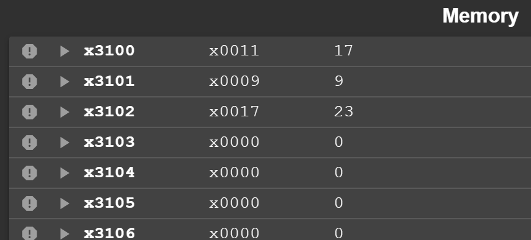

# Lab 1 report

## Task

Write an program in LC-3 machine language that meets the following conditions:

1. Given n, if n is an odd number, count how many 0 are in the binary representation of n.
2. Otherwise, count how many 0 are in the 2's complement code of the negative of n.

## Procedure

### Step 0/ Initialization

Use AND instructions to clear the registers that's needed.

### Step 1/ Judge whether the number is odd or even

Use an AND instruction on `#1` and R0 in which the original number is loaded. If the result is 0, the number is odd with the last digit being 1; otherwise the number is even.
Code:

### Step2/ Get the 2's complement of the number if it is an even number

Judge if the number is even by judging the value stored in R0. If it is 0, then get the 2's complement of the original number, which is now loaded in R1.
Code:

### Step3/ Count the number of 0's

Use R2 as a counter loaded with 16. 
>N.B. The assembly languge can not process with a number that can not be represented by a 5-bit 2's complement, which means `#16` is not allowed. So it is necessary to use 2 instructions to add 16 to R2.

R1 is loaded with the number ready to be processed. Use an LDI instruction to aquire the number from `x3100`. 
R5 is loaded with an immediate number, and the "1 bit" of which moves 1 bit leftward every time the loop is executed. i.e. R5, starting from `0000 0000 0000 0001`, turns into `0000 0000 0000 0010` after the loop is executed once and such instruction executes 16 times. Use an ADD instruction to add it to itself.

Use AND instruction on R5 and R1 to bitwisely compare every bit. When the value, which is loaded in R4, is 0, R3 adds 1 to itself.

Use BRANCH instruction to judge whether the loop is done by judging if R2 is 0, which is a counter. 

### Step4/ Add to the result the last digit of my student number, which is 9 from `PB22111599`

Use an ADD instruction to achieve so. Then use an STI instruction to load the result into `x3102`.

## Result

 example 1:
 >      `17` (in decimal) in `x3100`
 >      `9` (in decimal) in `x3101`
 >      `17(D)` is an odd number, and is `0000 0000 0001 0001(B)`; it has 14 zeros.
 >      `14 + 9 = 23`, therefore the final result is 23.

 result 1:
 
 > `23` (in decimal) in `x3102`

 
 

 example 2:
 >       `100` (in decimal) in `x3100`
 >       `9` (in decimal) in `x3101`
 >       `100` is an even number, and its 2's comlement is `1111 1111 1001 1100(B)`;
 >       it has 4 zeros. 
 >       `4 + 9 = 13`, therefore the final result is 13.

 result 2:
 
 > `13` (in decimal) in `x3102`
