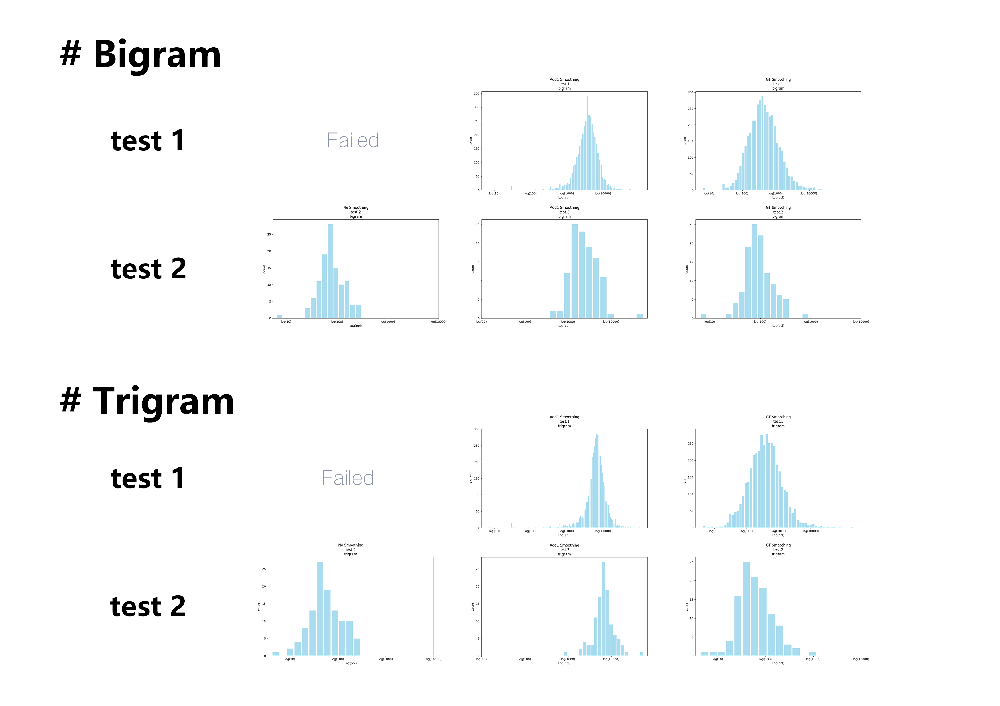

# 文本表征学习 Lab 1 统计语言模型

PB22111599 杨映川

## Pt.1 实验概述

使用训练数据构建统计语言模型，并使用不同平滑方法优化模型，对比分析不同模型及平滑策略在不同测试集上的性能。性能评估的标准是perplexity，即困惑度。

## Pt.2 模型实现

### 1. SRILM

本次实验本人在Linux上使用了SRILM工具包(SRI Language Modeling Toolkit)进行，该工具包基于n-gram算法，涵盖了从构建语言模型到评估语言材料性能等多方面的功能。

### 2. 句子判定

值得注意的是，SRILM工具包能对已经分好行的语段材料进行句子判定:

> SRILM implicitly assumes an \<s\> token in the beginning of each line and an \</s\> token at the end of each line and counts N-grams that start with \<s\> and end with \</s\>.*

*此段描述来自SRILM官网。

### 3. Token统计

执行指令`ngram-count -text train.txt -order 3 -write train.txt.count`，即可生成一个基于train.txt文件的trigram计数文件（train.txt文件已经事先进行了分词），`.count`文件的内容格式举例为
>       纳入	97
>       纳入 年终	1
>       纳入 年终 责任制	1
>       纳入 当前	1
>       纳入 当前 的	1
>       纳入 健康	1
>       纳入 健康 发展	1
可见`.count`文件以表格形式列出了1-gram，2-gram和3-gram的计数。

### 4. Smoothing策略

先后采用了“无平滑” “加一平滑” “Good-Turing平滑”对两个已经预先分好词的test.txt文件进行性能评估。其中“无平滑”和“加一平滑”都可以看作是加法平滑的特例。

>       #No Smoothing
>       -addsmooth 0
>       #Add-one Smoothing:
>       -addsmooth 1
>       #Good-Turing Smoothing
>       -gtmin 1

## Pt.3 实验结果

使用test文件中句子的perplexity的中位数作为评估指标。且test.1.txt中包含train.txt中未出现的token，test.2.txt中不包含train.txt中未出现的token.

### 3.1 Bigram测试结果

| Perplexity中位数** | 无平滑 | 加一平滑 | GT平滑 |
| :--------------: | :---: | :-----: | :----: |
|test1|            INFINITY***|3764.38 | 417.99|
|test2|            72.59|    2057.17|   88.24|

**结果统一保留两位小数；
***INFINITY表示没有平滑导致算法失效。

### 3.2 Trigram测试结果

| Perplexity中位数 | 无平滑 | 加一平滑 | GT平滑 |
| :--------------: | :---: | :-----: | :----: |
|test1|            INFINITY|6617.12 | 380.77|
|test2|            51.03|    6547.04|   55.33|

### 3.3 测试结果分布综合

各测试在不同平滑策略下的困惑度分布如下（注意到横坐标为对数坐标）：

## Pt.4 Conclusions

1) **不平滑**在评估test.1.txt时算法失效（默认此时Perplexity为无穷），因为无法处理unseen tokens；但是对于不包含unseen tokens的test.2.txt，不平滑反而是此时最优的平滑算法。
2) **加一平滑**的平滑效果非常糟糕。考虑到train.txt文件的数据量较小且较为稀疏（即出现次数为1次、2次的token的数量非常多），如果对所有tokens直接进行加一处理，会导致较为严重的信息损失。
3) **GT平滑**的效果相对较好，原因可能是GT平滑较适合处理稀疏数据。
4) 对于加法平滑，猜测存在某个参数δ(0 < δ < 1)，使得介于无平滑和加一平滑之间的加δ平滑会给模型带来更好的测试结果。
5) 在使用加一平滑时，Trigram的性能反而低于Bigram，猜测加1对Trigram造成了更大规模的概率偏移，因此可以推测若采用“加δ平滑”，Trigram所要求的最优δ会远小于Bigram所要求的最优δ。

## Pt.5 Debugging Problems

1) SRILM工具包似乎不能适配Windows系统，尝试在Windows系统上安装失败后在Linux上进行尝试，遂成功；
2) SRILM工具包为了保证算法的可行性，默认在计算ppl时会自动忽略OOV（out-of vocabulary），除非在评估时加上`-unk`命令——此时会创造形如\<unk\>的token来替代OOV，再进行ppl的计算；
3) 根据3.3中的图像可见各个句子之间的ppl差异是以10的次方为数量级增加的。一个例子是，在使用GT平滑基于Trigram评估test.1.txt时，最低句子ppl为4.36，而最高句子ppl为218580.10；在两端数据相差如此悬殊的情况下，平均数很容易受到极端值的影响，故选择使用中位数作为评估标准；
